# 项目架构

## 1. 概述

本系统为**前后端分离**的 App 功能知识管理平台，用于管理树形功能节点（应用 → 分类 → 功能）、开发者审核流、设备信息、数据备份及 LLM 辅助描述优化。

| 层级 | 技术 |
|------|------|
| 前端 | Vue 3 + Vite + Element Plus + Vue Router |
| 后端 | Flask + Flask-SQLAlchemy + Flask-JWT-Extended |
| 数据库 | SQLite（单文件，`instance/app_knowledge.db`） |
| 实时通知 | SSE（Server-Sent Events，`/api/events`） |

---

## 2. 逻辑结构

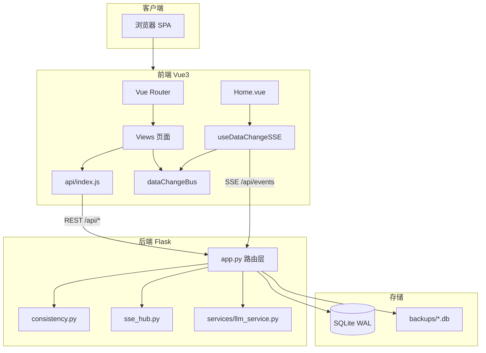

### 2.1 后端模块职责

| 模块 | 路径 | 职责 |
|------|------|------|
| 应用入口 | `backend/app.py` | 模型定义、REST 路由、备份调度、DB 初始化 |
| 一致性层 | `backend/consistency.py` | JWT 鉴权、COW 读模型、revision 锁、审计 JSON、SSE 发射 |
| SSE 中心 | `backend/sse_hub.py` | 内存发布/订阅（要求 Gunicorn `-w 1`） |
| 迁移 | `backend/migrations/migrate_to_2_0_0.py` | Schema 2.0.0 全量迁移 |
| LLM | `backend/services/llm_service.py` | 大模型调用封装 |

### 2.2 前端模块职责

| 模块 | 路径 | 职责 |
|------|------|------|
| 路由 | `frontend/src/router/index.js` | 页面路由、登录守卫 |
| API | `frontend/src/api/index.js` | Axios 封装、Token 注入、401 跳转 |
| SSE | `frontend/src/composables/useDataChangeSSE.js` | EventSource 连接、变更通知 |
| 事件总线 | `frontend/src/utils/dataChangeBus.js` | 页面内「立即刷新」联动 |
| 功能树 | `frontend/src/views/Features.vue` | 核心业务 UI |

---

## 3. 核心时序

### 3.1 认证流程

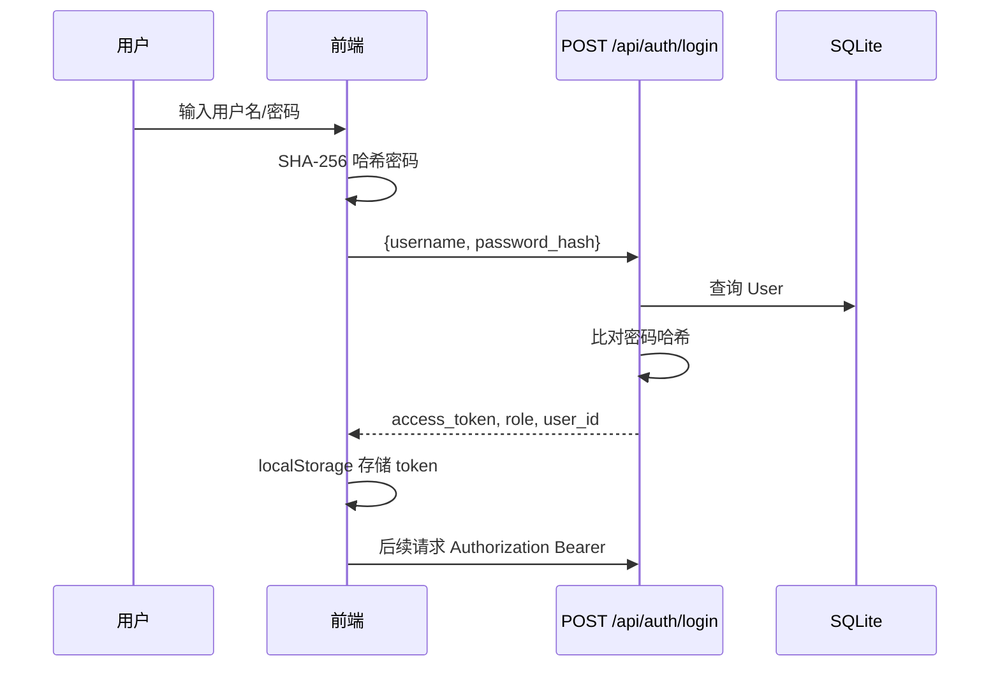

### 3.2 COW 审核写入（开发者）

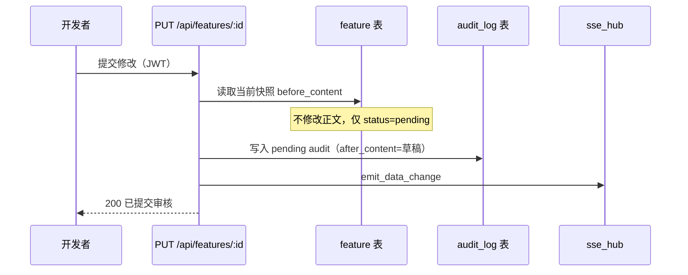

### 3.3 COW 读取隔离

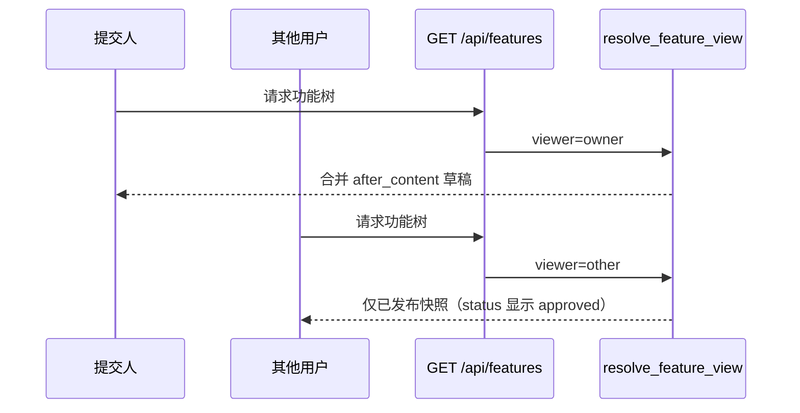

### 3.4 管理员审核批准

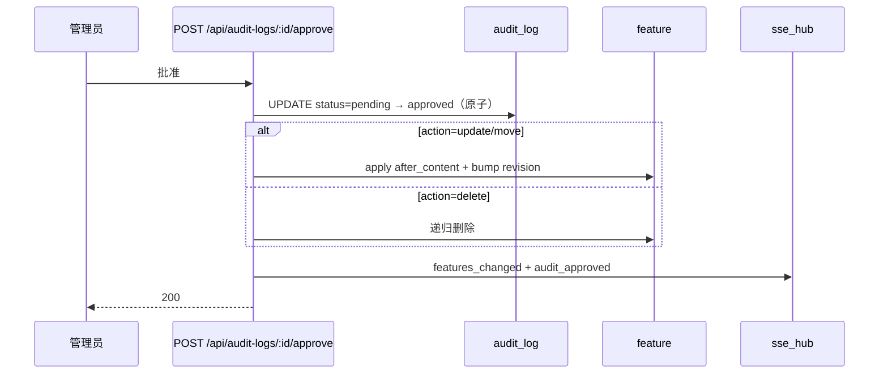

### 3.5 SSE 数据变更通知

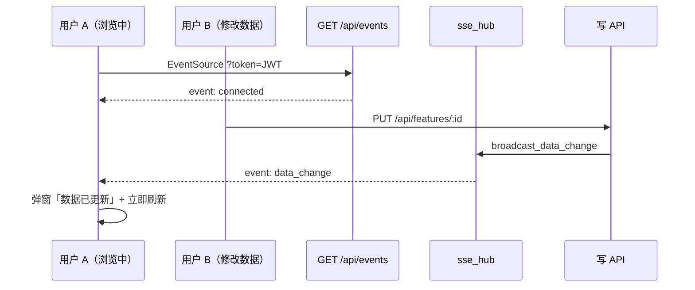

### 3.6 revision 乐观锁（管理员）

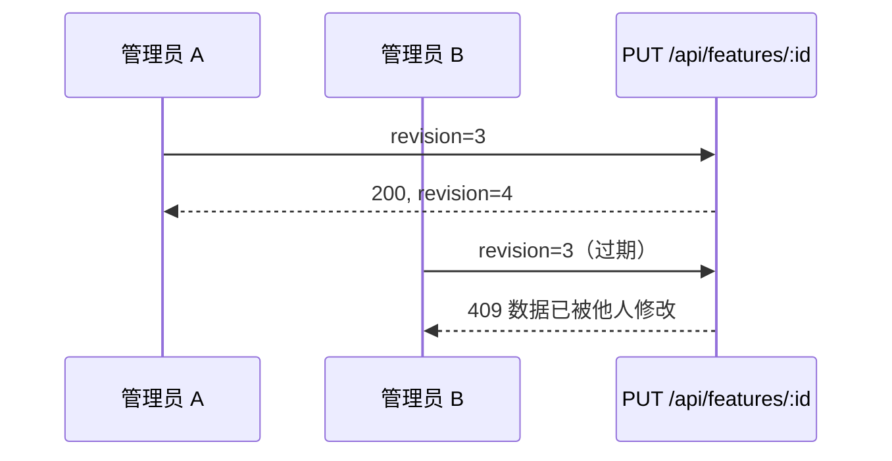

---

## 4. 类图（核心领域模型）

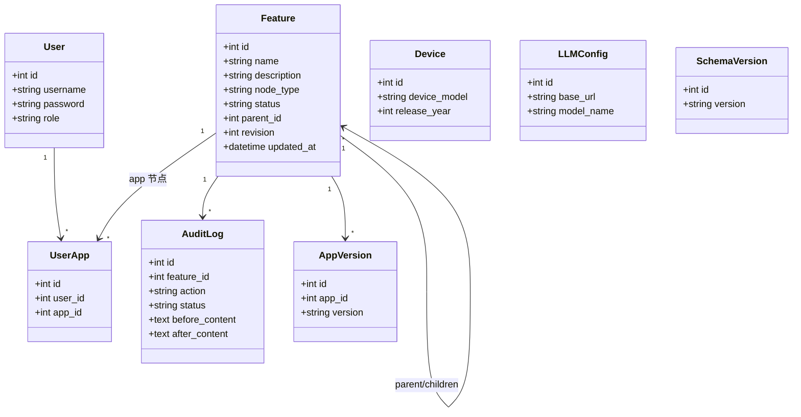

### 4.1 一致性辅助模块（非 ORM）

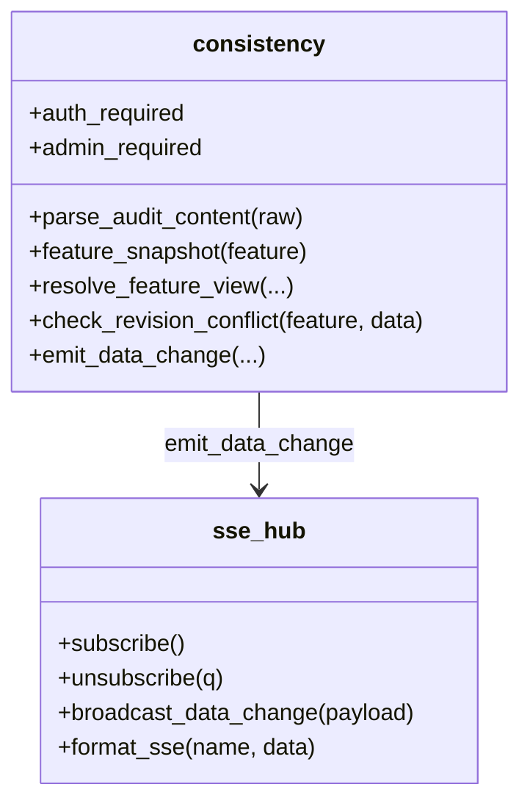

---

## 5. 数据库设计

### 5.1 ER 关系

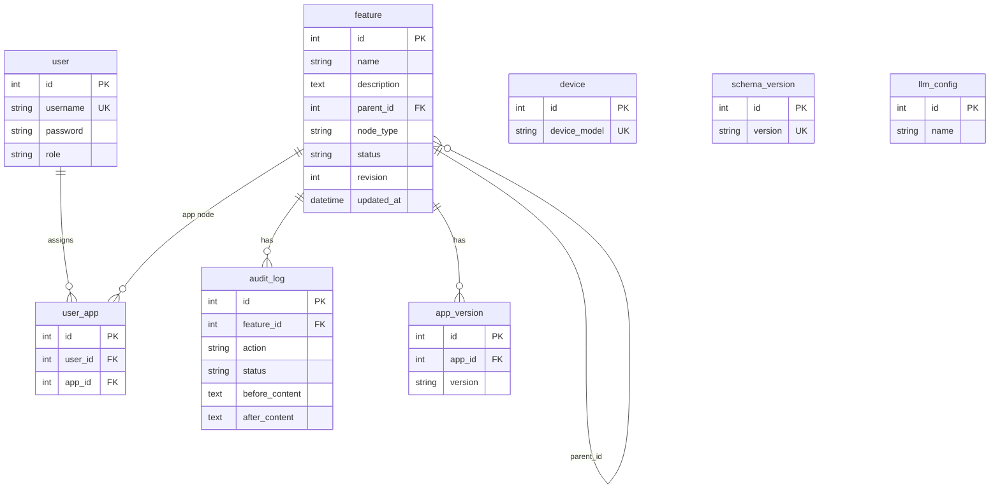

### 5.2 表说明

| 表名 | 说明 |
|------|------|
| `user` | 系统用户（admin / developer） |
| `user_app` | 开发者可访问的应用授权 |
| `feature` | 树形功能节点（app / category / function） |
| `audit_log` | 审核记录，COW 草稿与快照 |
| `device` | 终端设备型号 |
| `app_version` | 应用版本与 changelog |
| `schema_version` | 数据库 schema 版本链 |
| `llm_config` | 大模型连接配置 |

### 5.3 Schema 版本演进

| 版本 | 来源 | 主要变更 |
|------|------|----------|
| 1.0.1 | 应用首次启动默认 | 基础表结构 |
| 1.1.0 | `migrate_database.py` | 新增 `llm_config` |
| 2.0.0 | `migrations/migrate_to_2_0_0.py` | `revision`/`updated_at`、audit JSON、pending 回迁、唯一索引 |

### 5.4 索引与约束

```sql
-- 2.0.0 迁移后
CREATE UNIQUE INDEX idx_feature_parent_name
ON feature(parent_id, name)
WHERE parent_id IS NOT NULL;
```

SQLite 连接级配置（每次连接执行）：

- `PRAGMA journal_mode=WAL`
- `PRAGMA busy_timeout=5000`
- `PRAGMA foreign_keys=ON`

### 5.5 节点类型与状态

**node_type：** `app` → `category` → `function`（树形父子）

**status：**

| 值 | 含义 |
|----|------|
| `approved` | 已发布 |
| `pending` | 有待审变更（COW 下行内可能仍为已发布内容） |
| `rejected` | 审核拒绝（历史状态） |

**audit_log.action：** `create` | `update` | `delete` | `move`

---

## 6. 部署架构

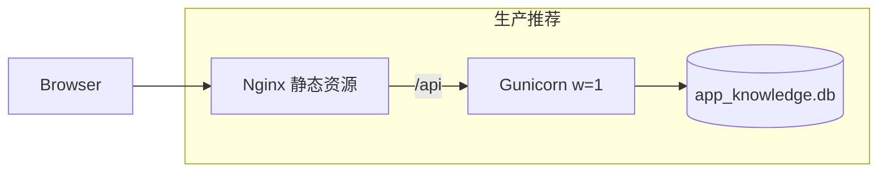

**约束：**

- Gunicorn 必须 **单 worker**（`-w 1`），否则 SSE 内存广播无法跨进程
- 禁止多机共享同一 SQLite 文件
- 备份/恢复期间进入 `maintenance_mode`，阻断写 API

---

## 7. 安全模型

| 角色 | 能力 |
|------|------|
| `admin` | 全功能；直接写库；审核；用户/备份/设备管理 |
| `developer` | 授权应用内 COW 提交；查看已发布 + 自己的草稿 |

鉴权方式：JWT Bearer（8 小时过期），角色从 Token claims 读取，**不信任**请求体中的 `user_role`。
